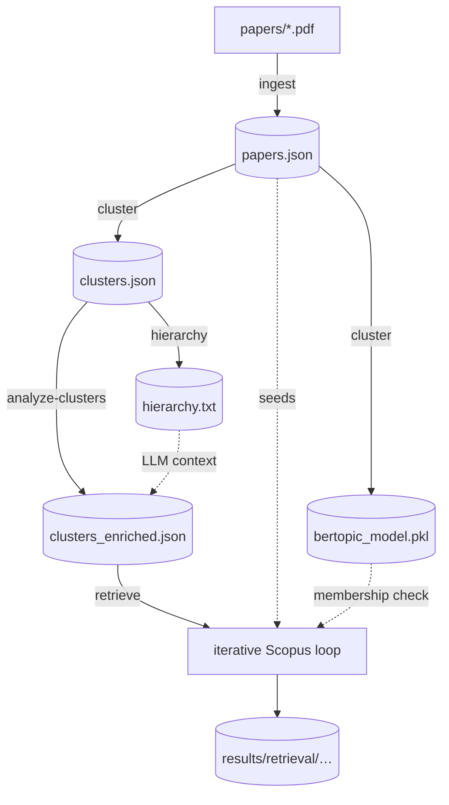

# Seedling — Literature Review Pipeline

[](LICENSE)
[](pyproject.toml)
[](#)
[](https://doi.org/10.5281/zenodo.23065919)

Modular, multi-stage pipeline to search, cluster, expand and evaluate scientific
literature, starting from a handful of seed papers (PDFs). It ingests and
enriches papers, clusters them with BERTopic, characterizes each cluster with
an LLM, and runs an iterative Scopus retrieval loop to expand each cluster with
relevant literature.

------------------------------------------------------------------------

## 📑 Contents

- [Why Seedling?](#-why-seedling)
- [System requirements](#-system-requirements)
- [Environment setup](#-environment-setup)
- [API keys (`.env`)](#-api-keys-env)
- [Quick start](#-quick-start)
- [Architecture](#-architecture)
- [Pipeline stages and outputs](#-pipeline-stages-and-outputs)
- [End-to-end example](#-end-to-end-example-fictitious-data)
- [Command reference](#-command-reference-flags-and-defaults)
- [LLM models per stage](#-llm-models-per-stage)
- [Configuration reference](#-configuration-reference)
- [Tuning recipes](#-tuning-recipes)
- [How retrieval works](#-how-retrieval-works-interpreting-the-output)
- [Reproducibility & caching](#-reproducibility--caching)
- [Human-in-the-loop review](#-human-in-the-loop-cluster-review-hitl)
- [Title-correction system](#-title-correction-system-ingest)
- [Project layout](#-project-layout)
- [Project goal](#-project-goal)
- [Troubleshooting](#-troubleshooting)
- [Usage notes & limitations](#-usage-notes--limitations)
- [Citing Seedling](#-citing-seedling)
- [License](#-license)
- [Acknowledgements](#-acknowledgements--attribution)

------------------------------------------------------------------------

## 🌱 Why Seedling?

Plenty of tools help you *discover* literature, but they treat relevance as a
fixed black box. Seedling is built around a different idea: **start from a few
seed papers you already trust, and tune what "similar" means to you.**

You decide how much each signal weighs when ranking candidates, and the ranking
changes accordingly:

-   **Similarity type** — lexical (term overlap), semantic (embedding), concept
    (curated cluster concepts), or closeness to the seed set.
-   **Relevance** — how strongly a candidate must match the cluster's theme.
-   **Novelty** — `recency` (recent work scores higher).
-   **Impact** — `citation_velocity` (citations per year).
-   **Kind of work** — `work_type_match` (e.g. keep a *survey* cluster from
    being flooded by empirical papers).

These are plain weights in
[`configs/retrieval/relevance.yaml`](configs/retrieval/relevance.yaml): raise
`recency` to favour fresh work, raise `citation_velocity` to favour high-impact
work, raise `seed_overlap` to stay close to your seeds. The same corpus yields
different expansions depending on how you set them.

**Scope & invitation.** Seedling started as a solution to one specific research
need (doctoral work on decision and optimization systems). It is open-sourced
precisely so it can be **adapted to other use cases or repurposed beyond mere
discovery** — e.g. as a configurable relevance/ranking layer, a reproducible
corpus builder, or a component in a larger system. The scoring, the agents and
the pipeline stages are modular on purpose.

**Determinism.** The retrieval query is built **entirely from deterministic
signals** — the cluster's c-TF-IDF keyphrases, one verbatim phrase per seed, and
recall-safe AND-constraints — **not** from the LLM. So the same corpus produces the
**same Scopus query and the same articles** on every run (verified: two back-to-back
runs gave byte-identical queries for all 13 clusters, and identical kept counts;
any residual difference in *which* papers come back is Scopus re-ranking its own
index over time, not the pipeline). Clustering is seeded (`random_state`), scoring
is a fixed formula, and clusters/papers are emitted in a stable sorted order. The
LLM still writes the human-facing cluster *briefs* (theme, rationale, contrast) and
that prose can vary run-to-run, but it no longer touches the query. You can also pin
a run fully (see [Reproducibility & caching](#-reproducibility--caching)).

------------------------------------------------------------------------

## 🧠 System requirements

-   Python >= 3.12
-   Conda (Miniforge recommended)
-   pip (inside the Conda environment)
-   CMake and LLVM 20 (installed automatically on macOS via Homebrew by
    `scripts/bootstrap.sh`; needed by the BERTopic stack: `llvmlite`/`numba`)

------------------------------------------------------------------------

## ⚙️ Environment setup

> **Project environment: conda `seedling`.**
> The pipeline, tests and bootstrap all run in this environment. The `make`
> targets invoke it by **absolute path**
> (`~/miniforge3/envs/seedling/bin/...`) on purpose: on machines with
> `pyenv`, its shims come first on `PATH` and shadow conda's `python`, so
> `conda activate` / `conda run` are not reliable here. If your miniforge
> lives elsewhere: `make <target> CONDA_HOME=/path/to/miniforge3`.

```bash
# 1. Install Miniforge: https://conda-forge.org/download/
# 2. Create the environment (include pip so make setup can install deps)
conda create -n seedling python=3.12 pip -y
conda activate seedling
# 3. Install dependencies (CMake/LLVM 20 + requirements.txt)
make setup            # = scripts/bootstrap.sh
```

`make setup` upgrades `pip`/`setuptools`/`wheel` and installs
`requirements.txt`. If you don't need the BERTopic native stack rebuilt, a
plain `pip install -r requirements.txt` inside the env also works (wheels are
available for `llvmlite`/`numba` on common platforms).

------------------------------------------------------------------------

## 🔑 API keys (`.env`)

Create a `.env` file in the project root (it is git-ignored and loaded
automatically at runtime). Use `.env.example` as a template:

```bash
SCOPUS_API_KEY=your_scopus_api_key
instoken=your_scopus_institutional_token   # Elsevier institutional token (lowercase key)
OPENAI_API_KEY=your_openai_api_key
SERPAPI_KEY=                                # optional; used by the title-fixer (ingest), not by retrieval
```

| Key | Used for | Required? |
|---|---|---|
| `SCOPUS_API_KEY` | Scopus enrichment (ingest) and the Phase-7 retrieval loop (only live retrieval source) | for enrichment / retrieval |
| `instoken` | Elsevier institutional token, paired with the Scopus key | with the Scopus key |
| `OPENAI_API_KEY` | LLM steps: title-fixer fallback (ingest), cluster briefs (analyze-clusters), query expansion + iteration reviewer (retrieve) | for those steps |
| `SERPAPI_KEY` | Google Scholar lookup fallback inside the title-fixer (ingest); **not** used in retrieval | optional |

The pipeline degrades gracefully when a key is missing (e.g. the Scopus agent
disables itself and skips, rather than crashing). PDFs alone give a usable
baseline.

> **`pybliometrics` credentials & the InstToken footgun.** At runtime the
> retrieval loop pushes the Scopus key + `instoken` onto `pybliometrics` from
> `.env`, so the `.env` values win during a normal run. But `pybliometrics` also
> keeps its own config at `~/.config/pybliometrics.cfg`
> (`[Authentication] APIKey` / `InstToken`) as a fallback. If that file holds an
> **InstToken that does not match the API key**, the count-probe path
> (`get_total_hits`, which routes through `pybliometrics`) fails authentication
> with *"Institution Token is not associated with API Key"* and surfaces as
> **0 hits** — easily mistaken for a genuinely empty query. Keep that file's
> `APIKey`/`InstToken` matching your `.env` (or leave them blank), and remember
> the env var is the lowercase `instoken`, not `SCOPUS_INSTTOKEN`.

------------------------------------------------------------------------

## 🚀 Quick start

Put the PDFs you want to analyze in `papers/` (see
[papers/README.md](papers/README.md)), then run the stages with `make`:

```bash
make ingest             # papers/ PDFs        -> data/processed/papers.json
make cluster            # cluster papers      -> results/clustering/clusters.json + model .pkl
make analyze-clusters   # LLM cluster briefs  -> results/cluster_analysis/clusters_enriched.json   (REQUIRED before retrieve)
make retrieve           # expand each cluster -> results/retrieval/.../phase7_cluster<ID>_*.json

make pipeline           # all of the above, in order: ingest -> cluster -> hierarchy -> analyze-clusters -> retrieve
make test               # pytest (in the conda env)
make help               # full list of targets and per-command flags
```

Pass flags to any command with `ARGS`:

```bash
make ingest   ARGS="--max-pdfs 10 --no-scopus"
make retrieve ARGS="--cluster-id 10 --max-iterations 8 --target-precision 0.60"
```

> With `make pipeline`, `ARGS` is routed only to the `cluster` step (use
> `ARGS="--hitl"` to pause for human review). Equivalent direct invocation:
> `~/miniforge3/envs/seedling/bin/python -m src.cli ingest --max-pdfs 10`.

Auxiliary targets: `make hierarchy` (export the BERTopic topic tree to
`txt/hierarchy.txt`, consumed by `analyze-clusters`) and `make freeze`
(`RUN=<ts>` or latest — freeze a retrieval run as the definitive dataset).

------------------------------------------------------------------------

## 🗺️ Architecture



Each stage is a CLI subcommand (`python -m src.cli <stage>`) backed by focused
agents: PDF / Scopus / arXiv ingestion + dedup → a BERTopic clustering agent →
an LLM cluster-analysis agent → a retrieval loop (query builder → relevance
scorer → evaluator → reviewer → stop policy).

------------------------------------------------------------------------

## 🔄 Pipeline stages and outputs

| Stage | Command | What it does | Produces |
|---|---|---|---|
| Ingestion | `ingest` | PDF extraction → title/DOI correction → Scopus enrichment → arXiv supplement → normalize → keyword synthesis → dedup | `data/processed/papers.json` |
| Clustering | `cluster` | BERTopic: SBERT embeddings → UMAP → HDBSCAN → c-TF-IDF top terms → labels | `results/clustering/clusters.json`, `clustering_metrics.json`, `models/clustering/bertopic_model_<ts>.pkl` |
| Hierarchy | `hierarchy` | Export a readable BERTopic topic tree | `txt/hierarchy.txt` + scipy artifacts in `results/clustering/` |
| Cluster analysis | `analyze-clusters` | LLM reads each cluster's papers + nearest neighbours, emits a structured `ClusterBrief` | `results/cluster_analysis/clusters_enriched.json` (**required before `retrieve`**) |
| Retrieval | `retrieve` | Per-cluster iterative loop: build deterministic Scopus query → per-year top-cited sample (concurrent) → hybrid rerank → recall/precision metrics → stop policy → BERTopic membership filter → per-cluster quality report | `results/retrieval/{strategies,iterations,results,metrics,focused,quality}/phase7_cluster<ID>_*_<ts>.json` (+ `quality/quality_report_<ts>.{json,txt}`) |

Per-cluster retrieval files: `..._strategies_*` (the query of each iteration),
`..._iterations_*` (full trace: query, metrics, reviewer feedback, stop
decision), `..._results_*` (`final_papers` ranked, with
`metadata.relevance_scores` and `metadata.bertopic_*`, plus `final_metrics` and
`stop_reason`), `..._metrics_*` (metrics history).

------------------------------------------------------------------------

## 📖 End-to-end example (fictitious data)

Suppose you study **agentic AI for clinical decision support** and drop two seed
PDFs in `papers/`. A full run looks like this (JSON snippets are abridged and
illustrative):

**1. Ingest** → `data/processed/papers.json`

```bash
make ingest
```
```json
{
  "paper_id": "pdf_agentic-clinical-2025",
  "title": "Agentic AI for Clinical Decision Support: A Survey",
  "abstract": "We survey autonomous LLM agents applied to clinical decision...",
  "keywords": ["agentic ai", "clinical decision support", "llm agents", "survey"],
  "authors": ["A. Researcher", "B. Coauthor"],
  "year": 2025,
  "doi": "10.1234/fict.2025.0001",
  "source": "merged",
  "venue": "Journal of Fictitious Medical AI",
  "citations_count": 12,
  "provenance": {"retrieved_from": ["local_pdf", "scopus"]}
}
```

**2. Cluster** → `results/clustering/clusters.json`

```bash
make cluster
```
```json
{
  "cluster_id": 0,
  "label": "agentic, clinical, decision",
  "top_terms": ["agentic", "clinical", "decision", "llm", "support"],
  "paper_ids": ["pdf_agentic-clinical-2025", "pdf_llm-triage-2024"],
  "is_noise": false
}
```

**3. Analyze clusters** (LLM brief) → `results/cluster_analysis/clusters_enriched.json`

```bash
make analyze-clusters
```
```json
{
  "cluster_id": 0,
  "synthesized_theme": "Autonomous LLM agents for clinical decision support",
  "work_type": "survey",
  "work_type_terms": ["survey", "review"],
  "distinctive_concepts": ["agentic ai", "clinical decision support", "tool-using agents"],
  "suggested_query_concepts": ["agentic ai", "clinical decision support", "autonomous agents"],
  "suggested_query_exclusions": ["robotic surgery"]
}
```

**4. Retrieve** (expand the cluster) → `results/retrieval/results/phase7_cluster0_results_<ts>.json`

```bash
make retrieve ARGS="--cluster-id 0"
```
```json
{
  "cluster_id": 0,
  "stop_reason": "target_precision_and_recall_met",
  "final_metrics": { "recall": 1.0, "estimated_precision": 0.62, "focus_score": 0.55, "n_results": 28 },
  "final_papers": [
    {
      "title": "Tool-Using Clinical Agents: An Empirical Study",
      "year": 2025, "doi": "10.1234/fict.2025.0042", "citations_count": 5,
      "metadata": {
        "relevance_scores": {
          "lexical": 0.41, "semantic": 0.78, "concept": 0.67, "seed_overlap": 0.71,
          "recency": 0.92, "citation_velocity": 0.18, "work_type_match": 0.50, "final": 0.61
        },
        "bertopic_nearest_topic": 0,
        "bertopic_cluster_match": true
      }
    }
  ]
}
```

The top hit scores high on `semantic` / `seed_overlap` / `recency` but low on
`citation_velocity` (it is new, with few citations). If you care more about
established work, raise `citation_velocity` in `relevance.yaml` and re-run: the
same cached candidate pool **re-ranks** toward higher-impact papers — no new
Scopus calls needed.

------------------------------------------------------------------------

## 🎛️ Command reference (flags and defaults)

### `ingest`
| Flag | Default | Meaning |
|---|---|---|
| `--max-pdfs N` | all | Max PDFs to process |
| `--no-scopus` | off | Skip Scopus enrichment |
| `--no-arxiv` | off | Skip arXiv supplementation |
| `--output PATH` | `data/processed/papers.json` | Output file |
| `--skip-title-fixer` | off (fixer runs) | Disable title/DOI correction |
| `--title-fixer-pages N` | `2` | PDF pages fed to the title-fixer LLM fallback |

### `cluster`
| Flag | Default | Meaning |
|---|---|---|
| `--papers-file PATH` | `data/processed/papers.json` | Papers to cluster |
| `--output PATH` | `results/clustering/clusters.json` | Clusters output |
| `--metrics-output PATH` | `results/clustering/clustering_metrics.json` | Metrics output |
| `--save-model` | on | Save the trained BERTopic model |
| `--model-dir PATH` | `models/clustering` | Where to save the model |
| `--hitl` / `--overrides PATH` / `--review-yaml PATH` | — | Human-in-the-loop review (see below) |

### `analyze-clusters`
| Flag | Default | Meaning |
|---|---|---|
| `--clusters-file PATH` | `results/clustering/clusters.json` | BERTopic output |
| `--enriched-papers PATH` | `data/processed/papers.json` | Title/abstract/DOI/keywords source |
| `--output PATH` | `results/cluster_analysis/clusters_enriched.json` | `ClusterBrief` output |
| `--model NAME` | `gpt-5.1` | OpenAI model (run at temperature 0) |
| `--hierarchy-file PATH` | `txt/hierarchy.txt` (`none` to skip) | Readable BERTopic tree, passed as LLM context |
| `--cluster-id N` | `-1` (all) | Analyze a single cluster |

### `retrieve`
| Flag | Default | Meaning |
|---|---|---|
| `--enriched-clusters PATH` | `results/cluster_analysis/clusters_enriched.json` | `ClusterBrief` JSON — **required** |
| `--clusters-file PATH` | `results/clustering/clusters.json` | BERTopic output |
| `--enriched-papers PATH` | `data/processed/papers.json` | Enrich seeds with real metadata |
| `--papers-dir PATH` | `papers` | Seed PDF directory |
| `--cluster-id N` | `-1` (all; skips noise `-1`) | Single cluster |
| `--output-dir PATH` | `results` | Output root |
| `--max-results N` | `30` | Max results per strategy |
| `--sampling-per-year N` | config (`75`) | Top-cited papers fetched per year (25 ≈ 1 Scopus page, so 75 ≈ 3) |
| `--sampling-window-years N` | config (`5`) | Recent years to sample (pool ≈ window × per-year) |
| `--max-iterations N` | `5` | Max query-refinement iterations |
| `--min-recall F` | `0.90` | Recall threshold to stop the loop |
| `--min-precision F` | `0.25` | Estimated-precision floor (repeated failure stops the loop) |
| `--target-precision F` | `0.60` | Stop only when `recall ≥ min_recall` AND `est_precision ≥ target` |
| `--core-axes-min-hits N` | `2000` | Keep the brief's AND-of-axes query only if it returns ≥ N Scopus hits, else fall back to the broad OR query. Lower it for tighter, higher-precision pools |
| `--reviewer-model NAME` | `gpt-4.1` | OpenAI model for the iteration reviewer (chat model at temp 0 + seed → reproducible; a reasoning model gives stronger but non-deterministic feedback) |
| `--scoring-config PATH` | `configs/retrieval/relevance.yaml` | Scorer weights / sampling / subject-area / recency |
| `--bertopic-model PATH` | latest in `models/clustering/` (`none` to skip) | Model for membership verification |

------------------------------------------------------------------------

## 🤖 LLM models per stage

The pipeline calls OpenAI in three stages (all need `OPENAI_API_KEY`); each uses
a different model, configurable where noted:

| Stage | Component | Model | Configurable |
|---|---|---|---|
| `ingest` | Title-fixer fallback | `gpt-4o-mini` → `gpt-3.5-turbo` | no (hard-coded) |
| `analyze-clusters` | Cluster brief generation | `gpt-5.1` | `--model` |
| `retrieve` | Query keyword expansion | `gpt-3.5-turbo` | no (hard-coded) |
| `retrieve` | Iteration reviewer | `gpt-4.1` | `--reviewer-model` |

Calls run at low/zero temperature where the model allows it, for reproducible
output. Without `OPENAI_API_KEY`, each stage falls back to a deterministic
non-LLM path (the title-fixer skips its LLM step, the reviewer uses a heuristic).

------------------------------------------------------------------------

## 🧩 Configuration reference

Only two config files are read by the pipeline: `configs/clustering/bertopic.yaml`
(clustering) and `configs/retrieval/relevance.yaml` (retrieval).
`configs/clustering/cluster_overrides.yaml` is the HITL review template.

### `configs/retrieval/relevance.yaml`

```yaml
weights:                 # RelevanceScorer components (sum ≈ 1.0; NOT auto-normalized)
  lexical: 0.15          # TF-IDF cosine of query+cluster text vs candidate
  semantic: 0.25         # SBERT cosine of cluster centroid vs candidate
  concept: 0.15          # fraction of the brief's distinctive concepts present in the candidate
  seed_overlap: 0.15     # max SBERT cosine of the candidate vs any seed paper
  recency: 0.10          # 0.5 ^ (age_years / half_life_years)
  citation_velocity: 0.10# min(1, (citations / years_since_pub) / saturation)
  work_type_match: 0.10  # fraction of the brief's work_type_terms present in the candidate
recency:
  half_life_years: 3     # a paper this old scores ~0.5
  current_year: null     # null = current system year
citation_velocity:
  saturation: 30.0       # velocity at/above this scores 1.0
subject_areas:           # hard AND filter applied to every Scopus query
  enabled: true
  codes: [COMP, BUSI, ENGI, SOCI, DECI, ECON]
sampling:                # candidate pool = deduplicated union of per-year top-cited papers
  window_years: 5
  per_year_results: 75
  sort: "-citedby-count,-coverDate"
```

### `configs/clustering/bertopic.yaml` (key options)

```yaml
bertopic:
  embedding_model: "all-MiniLM-L6-v2"
  umap:    { n_neighbors: 3, n_components: 5, min_dist: 0.0, metric: cosine, random_state: 1001 }
  hdbscan: { min_cluster_size: 2, min_samples: 1, cluster_selection_method: leaf }
  nr_topics: null
  auto_tune:      { enabled: true }   # grid search over HDBSCAN params, scored by a composite metric
  semantic_merge: { enabled: true, similarity_threshold: 0.85 }  # merge near-duplicate topics
  preprocessing:  { lowercase: true, remove_accents: true, remove_numbers: true, min_words_per_doc: 120 }
```

The clustering corpus per paper is `title + abstract + keywords`, preprocessed
(lowercased, accents/special-chars/numbers stripped, stopwords removed). The
trained model is persisted so retrieval reuses the same embedding backend.

------------------------------------------------------------------------

## 🎚️ Tuning recipes

Edit `weights:` in `configs/retrieval/relevance.yaml` (or pass a different
`--scoring-config`) to bias the ranking. The same candidate pool **re-ranks** —
no new Scopus calls. Starting points:

**Favour recent work** (track a fast-moving topic):
```yaml
weights: { lexical: 0.10, semantic: 0.25, concept: 0.15, seed_overlap: 0.10,
           recency: 0.30, citation_velocity: 0.05, work_type_match: 0.05 }
```

**Favour high-impact work** (established, well-cited):
```yaml
weights: { lexical: 0.10, semantic: 0.25, concept: 0.15, seed_overlap: 0.10,
           recency: 0.05, citation_velocity: 0.30, work_type_match: 0.05 }
```

**Stay close to the seed set** (tight, conservative expansion):
```yaml
weights: { lexical: 0.10, semantic: 0.25, concept: 0.15, seed_overlap: 0.35,
           recency: 0.05, citation_velocity: 0.05, work_type_match: 0.05 }
```

Weights need not sum to 1 (they are not auto-normalized), but keeping them near
1.0 makes the `final` score easy to read. Tighten precision with
`--target-precision`; widen the candidate pool with `--sampling-per-year`.

------------------------------------------------------------------------

## 📈 How retrieval works (interpreting the output)

-   **Hybrid relevance score** — each candidate gets a blend of the components
    above; `metadata.relevance_scores` records the per-component and `final`
    scores so a ranking can be explained.
-   **`estimated_precision`** (per iteration) = mean relevance `final` score
    over the top-20 candidates; **`focus_score`** = mean `concept` over the
    top-20.
-   **Coverage-probe recall** — recall is *not* the fraction of seeds in the
    top-N download. For each seed with a DOI, the system runs
    `(effective_query) AND DOI("seed_doi")`; ≥1 hit means the seed is covered.
    `recall = covered_seeds / total_seeds`. A seed not indexed in Scopus caps
    achievable recall below 1.0, and the loop recognizes that ceiling and stops.
-   **Per-year top-cited sampling** — the candidate pool is the deduplicated
    union of the most-cited papers per year across the window. The
    relevance-sorted first page is dominated by brand-new, 0-citation papers,
    so per-year sampling ensures both recent and high-impact papers are present
    (otherwise the `recency`/`citation_velocity` components can't discriminate).
-   **BERTopic membership verification** — each retrieved paper is re-checked
    against the saved model; the robust signal is the nearest topic embedding
    (`metadata.bertopic_nearest_topic`, `bertopic_similarity_to_cluster`,
    `bertopic_cluster_match`). It is kept separate from the relevance score so
    it can filter/audit output independently.
-   **API failure vs. empty result** — transient Scopus failures (read/connection
    timeouts, `429`, `5xx`) are retried with exponential backoff first. A failure
    that persists past the retries — or a non-retryable one (`400`/`401`) — is
    raised as `ScopusAPIError` rather than silently swallowed as an empty result
    set. The affected iteration is logged as an error and recorded with
    `metadata.api_error = true`, and the FOCUS PHASE SUMMARY flags those clusters
    with **`⚠ API-ERROR`**. A `0` so flagged means *"the API call failed"*, not
    *"the query legitimately returned nothing"* — re-run just those clusters once
    the API recovers; the rest of the run is unaffected.
-   **Stop policy** — the loop stops on success (`recall ≥ min_recall` and
    `est_precision ≥ target_precision`), at `max_iterations`, on a severe recall
    regression (reverts to the best iteration), on repeated precision failures
    below `min_precision`, or on a precision plateau. The best iteration is selected
    by `(recall ≥ min_recall, n_results, recall, estimated_precision)` — recall first.
-   **Per-cluster quality report (auto, every run)** — after the FOCUS PHASE SUMMARY,
    `retrieve` writes `results/retrieval/quality/quality_report_<ts>.{json,txt}`
    (also re-runnable on any past run via `python scripts/quality_report.py`). Over
    each cluster's kept papers it aggregates the **BERTopic affinity** (mean / median
    / min + how many fall below 0.30, the borderline tail) and the **mean of each
    relevance component** plus the blended `final`, and names the component that
    contributes most to the score. Use it to sanity-check that the kept papers are
    on-topic and to see which signal drives the ranking. Example (fictitious data):

    ```text
    [1] Kept | relevance | cluster affinity
    cid kept kept% rel.mu aff.mu aff.min aff<.3  strongest  label
      0  210   56%  0.41   0.67    0.34       0   semantic   human-AI decision support
      1   60   12%  0.40   0.62    0.38       0   semantic   LLM-based agents (surveys)
      2  300   51%  0.31   0.51    0.16       9   semantic   multi-agent trust

    [2] Relevance components (mean; * = strongest weighted contributor to final)
    cid |  lex    sem    con   seed    rec    cit  wtype | final
      0 | 0.14  0.42*  0.13   0.61   0.66   0.53   0.44  | 0.41
      2 | 0.09  0.30*  0.00   0.35   0.71   0.68   0.27  | 0.31
    ```

    Read it as: cid 1 keeps only 12% but those papers are still high-quality (rel
    0.40, affinity 0.62, no borderline) → the filter is selective, not random; cid 2
    is the one to eyeball — high kept% yet lower affinity (min 0.16, 9 borderline),
    a broad query pulling in marginal papers. (`semantic` is usually the strongest
    contributor; `concept` near 0 is a known weak signal.)

------------------------------------------------------------------------

## 🔁 Reproducibility & caching

You can re-run the pipeline and keep working on the **same set of papers and
queries** without re-spending API quota:

-   **Scopus disk cache (`pybliometrics`).** Every Scopus response is cached on
    disk by `pybliometrics` and reused for identical queries (the code never
    forces a refresh). Re-running a query already issued returns the same result
    set with **no new API call**; only genuinely new queries hit Scopus. The
    *live* Scopus index changes over time, so issuing a query for the first time
    on a different day can return different papers — the cache only fixes
    queries you have already run.
-   **In-run caches.** Within a single run, Scopus lookups
    (`GLOBAL_SCOPUS_CACHE`) and LLM keyword expansions (`_expansion_cache`) are
    memoized, so each unique query/keyword costs **one** call, not many.
-   **Compute the LLM briefs once, reuse them.** `analyze-clusters` writes the
    cluster briefs to `results/cluster_analysis/clusters_enriched.json`;
    `retrieve` only *reads* that file (`--enriched-clusters`). So you run the
    LLM-backed analysis once and reuse the same briefs across as many `retrieve`
    runs as you want — no extra analysis calls.
-   **Freeze a run as the definitive dataset.** `make freeze` (`RUN=<ts>` or the
    latest) copies a validated run's outputs to `results/retrieval/final/` with a
    `MANIFEST.json`. Frozen files never change unless you re-freeze, giving a
    fully reproducible dataset to build on.

Determinism note: with the default deterministic query path the **Scopus query no
longer depends on the LLM** (and the per-iteration reviewer LLM is not even called),
so a re-run on the same corpus issues identical queries. The cluster *briefs* are
still LLM-written (temperature 0 + fixed seed + strict JSON, best-effort but not
guaranteed identical), but their prose doesn't change the query — only the
human-facing analysis. This default can be switched with
`make retrieve ARGS="--llm-steered"`, which lets the brief steer the query: its
`core_query_axes`, suggested concepts/exclusions, brief-derived work-type terms,
and the per-iteration reviewer's add/exclude/stop actions. That mode is more
adaptive but **no longer byte-reproducible**, because the query then depends on
non-deterministic LLM output; leave it off for a reproducible corpus.

Performance note: the per-year sampling and per-seed coverage probes run
concurrently (bounded by the Scopus rate limit) and candidate embeddings are cached
across iterations, ~1.8× faster per cluster with **identical results** (verified).

------------------------------------------------------------------------

## 👤 Human-in-the-loop cluster review (HITL)

BERTopic's grouping is a starting point, not the last word. The `cluster` step
lets a human override it deterministically; the edited YAML is the **single
source of truth** for the change.

**Two ways to run it**

- **Interactive** — `make cluster ARGS="--hitl"` pauses after BERTopic, writes an
  editable snapshot to `results/clustering/cluster_review.yaml`, and waits for you
  to edit it and type `ready` in the console (requires a stdin TTY).
- **Offline** — prepare that same YAML ahead of time and apply it without the
  prompt: `make cluster ARGS="--overrides path/to/review.yaml"`.

Either way the edits are applied deterministically, `clusters.json` is
re-exported, and a JSON audit log records the full diff (papers moved, labels
changed, clusters created/dropped). If any paper changed cluster, the c-TF-IDF
top terms of the affected clusters are recomputed.

**What you can change** — each is a plain edit to the YAML (format in
[`configs/clustering/cluster_overrides.yaml`](configs/clustering/cluster_overrides.yaml)):

| Operation | How |
|---|---|
| Rename a cluster | edit its `label` (and optional `description`) |
| Move a paper | list its `id` under a different cluster |
| Exclude a paper | move its `id` under the noise block (`id: -1`) |
| Rescue noise into a new cluster | add a block with a fresh `id` and list the paper(s) |
| Merge / drop a cluster | move its papers elsewhere, then delete the whole block |

**Example** — rename cluster 0, move a paper into it, and rescue a paper that
HDBSCAN sent to noise into a new cluster 100:

```yaml
version: 1
clusters:
  - id: 0
    label: "human-centred evaluative decision support"   # renamed
    papers:
      - { id: pdf_miller_2023 }
      - { id: pdf_moved_here }          # moved in from another cluster
  - id: 100                             # new cluster (rescued from noise, id -1)
    label: "AI-enabled strategy & decision-making"
    description: "Manual rescue of papers HDBSCAN marked as noise."
    papers:
      - { id: pdf_rescued_strategy }
  # ... every other cluster and paper must still be listed here ...
```

Then apply it non-interactively:

```bash
make cluster ARGS="--overrides review.yaml"
```

**Safety.** The applier validates *before* touching anything and aborts (writing
nothing) if the edit is inconsistent: every paper must end in exactly one
cluster, no paper may be invented (only existing `paper_id`s can be reassigned),
cluster ids must be unique, and empty cluster blocks are rejected (to drop a
cluster, remove its block entirely). A bad edit can therefore never silently
corrupt the corpus.

------------------------------------------------------------------------

## 🧪 Title-correction system (ingest)

Runs automatically before enrichment (disable with `--skip-title-fixer`):

-   CrossRef is the primary DOI/title validation source.
-   SerpAPI (Google Scholar) is a secondary lookup fallback when CrossRef has no
    clear match (needs `SERPAPI_KEY`).
-   OpenAI (`gpt-4o-mini`, falling back to `gpt-3.5-turbo`) is the last-resort
    fallback to propose a title/DOI.
-   Every suggestion is re-validated against CrossRef before being applied
    (prevents LLM-hallucinated references).
-   An audit report is written to `reports/title_corrections.json`.

------------------------------------------------------------------------

## 🔬 Post-hoc analysis scripts

Self-contained utilities under `scripts/` that read **only frozen artifacts**
(`results/`, `data/processed/papers.json`) and re-run **no** pipeline stage. They
produce the reproducible numbers and tables reported in the companion paper, and
each writes its output under `results/` and prints a summary. All resolve their
paths relative to the repo root, so they can be run from anywhere.

-   **`cluster_seed_map.py`** — joins the clustering assignment with the seed
    corpus and lists, per cluster, the seed papers BERTopic assigned to it
    (id, title, year, venue, DOI). Ground truth for the per-cluster seed lists.
    Reads `results/clustering/clusters.json` + `data/processed/papers.json`;
    writes `results/clustering/seed_cluster_map.json`.
    ```bash
    python scripts/cluster_seed_map.py
    ```
-   **`literature_extension.py`** — the *discovery layer*. For each cluster it
    ranks the kept (focused) papers by hybrid relevance, drops seeds (by DOI) and
    republished versions of seeds (by title similarity ≥ 0.85), and keeps the top
    *N* (default 5). Emits BibTeX entries (deterministic cite keys) and a LaTeX
    `\citep{...}` table body. Reads `results/retrieval/focused/` + the seed
    corpus; writes `results/retrieval/literature_extension.{bib,tex}`.
    ```bash
    python scripts/literature_extension.py            # top-5, most complete run
    python scripts/literature_extension.py --top 10 --run 20260526_184803
    python scripts/literature_extension.py --bib path/to/refs.bib   # avoid key clashes when merging
    ```
-   **`field_shift.py`** — quantifies the qualitative observation that the
    discovery layer traces each theme toward a neighbouring discipline. It
    classifies seed and discovered venues into the six Scopus broad areas used as
    the retrieval filter (COMP, BUSI, ENGI, SOCI, DECI, ECON; venue-based proxy,
    no ASJC code is stored) and reports, per cluster, whether the discovered
    modal discipline differs from the seeds' and the share falling outside it.
    Reads `clusters.json` + seed corpus + `results/retrieval/focused/`; writes
    `results/retrieval/field_shift.json`.
    ```bash
    python scripts/field_shift.py
    ```
-   **`compute_coherence.py`** — post-hoc `c_v` topic coherence (Röder et al. 2015)
    of each cluster's c-TF-IDF top terms against the seed corpus. Requires
    `gensim`. Writes `results/clustering/coherence.json`.
-   **`extract_hierarchy.py`** — exports the BERTopic Ward-linkage hierarchy
    (`results/clustering/hierarchy_tree.txt` and friends) behind the supergroup
    structure.

The most-complete-run helper used by `literature_extension.py` and
`field_shift.py` selects the run with the most **non-empty** clusters, so a
single-cluster re-execution or a run with a failed cluster does not shadow the
canonical full run; pass `--run <timestamp>` to override.

------------------------------------------------------------------------

## 📁 Project layout

Tracked in the repository:

-   `src/` — pipeline code
-   `configs/` — clustering + retrieval configuration
-   `scripts/` — bootstrap and helper scripts
-   `stws/` — English stopword list used for text cleaning
-   `tests/` — unit and integration tests
-   `papers/` — drop your PDFs here (the PDFs themselves are git-ignored)

Generated or local-only (git-ignored, created at runtime): `data/`,
`results/`, `models/`.

------------------------------------------------------------------------

## 🧭 Project goal

A reproducible pipeline for AI-assisted systematic review: automatic
enrichment of scientific literature, semantic clustering of papers, and
iterative retrieval to expand each topic — built to support doctoral research
on decision and optimization systems.

------------------------------------------------------------------------

## 🩺 Troubleshooting

| Symptom | Cause / fix |
|---|---|
| `ModuleNotFoundError: No module named 'stws'` | Run from the repo root so the `stws/` stopword package is importable; use `make` or `python -m src.cli`. |
| `make setup` fails with `No module named pip` | The conda env was created without pip. `make setup` now bootstraps it via `ensurepip`; if that fails, run `conda install -n seedling pip -y` and retry. Recreating the env as `conda create -n seedling python=3.12 pip -y` avoids it. |
| `No module named 'dotenv'` (or other deps) | Dependencies not installed — run `make setup` (or `pip install -r requirements.txt`) inside the `seedling` env. |
| `llvmlite` / `numba` build fails | The BERTopic stack needs LLVM 20 + CMake; run `make setup` (installs them on macOS via Homebrew) or install them with your package manager. |
| `conda activate` picks the wrong Python | `pyenv` shims can shadow conda; use the `make` targets (absolute env path) or call `~/miniforge3/envs/seedling/bin/python` directly. |
| Scopus `401` / empty results | Check `SCOPUS_API_KEY` + `instoken` in `.env`, and that your institution's subscription covers the query. Also check `~/.config/pybliometrics.cfg`: a stale `InstToken` there that doesn't match the key fails auth (*"Institution Token is not associated with API Key"*) and shows up as **0 hits**. |
| Scopus `429` (quota) | Quota hit; reuse the disk cache (re-run identical queries) or wait for the quota window to reset. |
| Cluster shows `0` flagged `⚠ API-ERROR` in the FOCUS PHASE SUMMARY | The `0` is a Scopus API failure (auth/quota/rate-limit/transport), not an empty result. Fix credentials/quota, then re-run only those clusters: `make retrieve ARGS="--cluster-id <ID>"`. |
| `retrieve` aborts: enriched clusters required | Run `make analyze-clusters` first — `retrieve` needs `clusters_enriched.json`. |
| LLM steps are skipped | `OPENAI_API_KEY` missing — set it in `.env`, or accept the deterministic non-LLM fallbacks. |

------------------------------------------------------------------------

## ⚠️ Usage notes & limitations

-   **API cost / quota.** Scopus enforces request quotas and OpenAI calls are
    billed. The Scopus disk cache and `make freeze` keep cost down by avoiding
    repeated queries; large corpora or many `retrieve` iterations multiply both
    Scopus calls and LLM cost.
-   **Domain adaptation.** The `subject_areas` hard filter in `relevance.yaml`
    (`COMP, BUSI, ENGI, SOCI, DECI, ECON`) is tuned to this project's domain. If
    you adapt Seedling to another field, change those codes (or disable the
    filter) and re-weight the scorer for what matters to you.
-   **Seed quality drives results.** The expansion is only as good as the seed
    papers and the cluster briefs; a noisy or off-topic seed set propagates into
    the queries and the ranking.
-   **Not a substitute for systematic-review rigor.** Seedling is an assistant;
    the human-in-the-loop review step is part of the intended workflow.
-   **Data leaves your machine.** Titles, abstracts and the first PDF pages are
    sent to OpenAI (title-fixer, cluster analysis), and queries go to
    Scopus/SerpAPI. Consider this if your seed papers are unpublished or
    confidential.
-   **Your Scopus entitlement matters.** What `retrieve` can fetch depends on
    your institution's Scopus subscription/view; abstracts and fields can be
    limited under a STANDARD view.
-   **Cross-machine reproducibility.** The `pybliometrics` cache is per-user
    (`~/.cache`), and clustering — though seeded — can vary slightly across
    library/hardware versions. For a portable, fixed dataset, share a `freeze`d
    run rather than relying on local caches.
-   In the **retrieval loop**, Scopus is the only live source (arXiv/RAG
    retrieval is not implemented). arXiv and SerpAPI **are** used during
    **ingestion**, not in retrieval: arXiv supplements missing/short abstracts,
    and SerpAPI is a title-fixer lookup fallback.
-   Recall can be capped below 1.0 when a seed paper is not indexed in Scopus.
-   The reviewer's `split` hint is modelled but not acted on (no automatic
    cluster splitting).
-   Tests that need network/API keys are marked `integration` and skipped by
    default; run them with `pytest -m integration` (needs a populated `.env`).

------------------------------------------------------------------------

## 📚 Citing Seedling

If you use Seedling in your research, please cite **both** the software and the
accompanying paper.

**Software** — see [`CITATION.cff`](CITATION.cff) (GitHub shows a *"Cite this
repository"* button that exports BibTeX/APA):

```bibtex
@software{seedling,
  author  = {Molina Abril, Gines},
  title   = {{Seedling: a fine-tunable, multi-stage literature-review pipeline}},
  year    = {2026},
  url     = {https://github.com/molina-abril/seedling},
  license = {AGPL-3.0-or-later}
}
```

**Paper** — *in preparation, not yet published.* Placeholder entry; update it
(and `CITATION.cff`) once the article has a venue/DOI:

```bibtex
@unpublished{molina-abril-seedling,
  author = {Molina Abril, Gines},
  title  = {{TITLE TBD}},
  note   = {Manuscript in preparation},
  year   = {2026}
}
```

------------------------------------------------------------------------

## 📄 License

Distributed under the **GNU Affero General Public License v3.0 or later
(AGPL-3.0-or-later)** — see [LICENSE](LICENSE).

In practice: you can use, study, modify and redistribute the code freely; any
distributed version **or one offered as a network service** must also remain
free and publish its source code.

## 🙏 Acknowledgements / attribution

Independent implementation. Two components are **inspired** by third-party
published work (no source code from them is used) — see [NOTICE](NOTICE):

-   **SemRank** — conceptual / hybrid reranking —
    [yzhan238/SemRank](https://github.com/yzhan238/SemRank)
-   **ResearchAgent** — iterative multi-agent reviewing pattern —
    [JinheonBaek/ResearchAgent](https://github.com/JinheonBaek/ResearchAgent)
